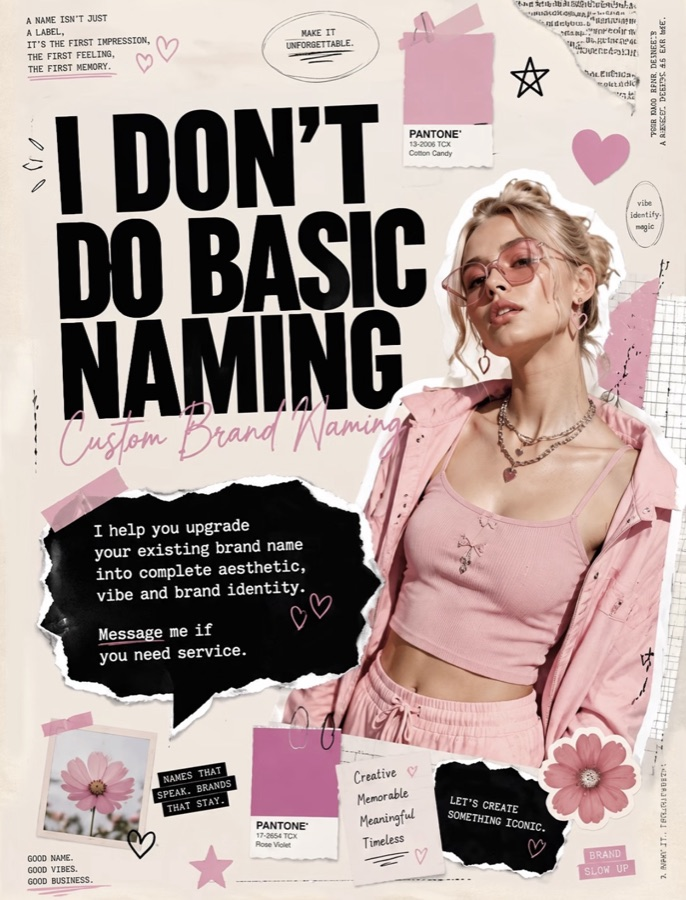

# 封面设计 Skill｜AI Cover Design Skill for Codex

面向中文内容创作者的 AI 封面设计 Skill。用于生成小红书、公众号、视频号、抖音与社交媒体封面；支持真人出镜、主标题、副标题、语义配图和 9 种可选视觉模板。

> Chinese AI cover design Skill for Codex — design finished social-media cover images from your title and photos.

## 能做什么

- 生成小红书封面、公众号封面、视频封面与图文首图
- 上传真人照片后，优先保留可识别的脸部与身份特征
- 先展示风格、比例、人物表现、字体、背景与副标题选项；全部确认后再生成
- 支持 `9:16`、`3:4`、`4:3`、`16:9`、`1:1` 比例
- 从标题中提取具体名词或场景，转化为服务主题的视觉元素

## 9 种封面模板

| # | 风格 | 预览 |
| --- | --- | --- |
| 1 | 技能清单爆款 |  |
| 2 | 粉色杂志拼贴 |  |
| 3 | 搜索引导大字 |  |
| 4 | 黄色杂志教程 |  |
| 5 | 蓝绿撕纸教程 |  |
| 6 | 复古手写氛围 |  |
| 7 | 深色渐变风 |  |
| 8 | 黑金创作宣言 |  |
| 9 | 电影感居家拼图 |  |

完整构图规范见 [风格说明](references/styles.md)。参考图只用于选择视觉语言；生成时不复制其中的人物、品牌、原文或场景。

## 关于作者与学院

**刘坚伟**，完美一刻婚礼培训学院创始人，深耕婚礼行业 16 年；同时是一名自媒体创作者与 AI 深度玩家。

完美一刻婚礼培训学院专注于婚礼行业人才培训、内容增长与 AI 创作实战。刘坚伟持续将可重复的工作交给 AI 与自动化工具，已通过与 AI 协作完成多款实用工具。本 Skill 的目标，是让没有设计基础的内容创作者也能更快做出清晰、有辨识度、适合发布的中文社交媒体封面。

### 找到刘坚伟与完美一刻

- 网站：<https://aipmwa.com>
- 小红书：`pmwa1117`
- 抖音：`pmwa1117`
- 视频号：`Gary刘坚伟-完美一刻`

如果这个 Skill 帮你提高了内容生产效率，欢迎在以上平台关注刘坚伟，了解婚礼行业实战、个人 IP 内容增长与 AI 工具应用。

## 安装到 Codex

```bash
git clone https://github.com/vanmyl904-sketch/gary-liujianwei-xhs-cover-skills.git
mkdir -p ~/.codex/skills
cp -R gary-liujianwei-xhs-cover-skills ~/.codex/skills/gary-liujianwei-xhs-cover
```

重启 Codex 或新开对话后，使用 `$gary-liujianwei-xhs-cover`，或直接说“帮我做一张小红书封面”。

## 使用方式

1. 发送一张主图与封面标题；可额外发送 0–3 张附图。
2. 从 9 个模板中选择风格编号。
3. 选择比例、人物表现、字体、背景和副标题；也可以对任一项说“交给模型决定”。
4. Codex 根据已确认的选择生成最终封面。

## 搜索关键词 / Keywords

封面设计、AI 封面设计、小红书封面、公众号封面、视频封面、社交媒体封面、Codex Skill、AI Cover Design、Xiaohongshu Cover、WeChat Cover、Social Media Cover。

## License

[MIT](LICENSE)
